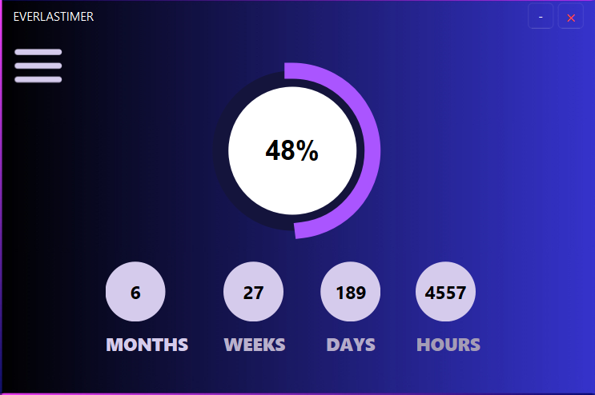
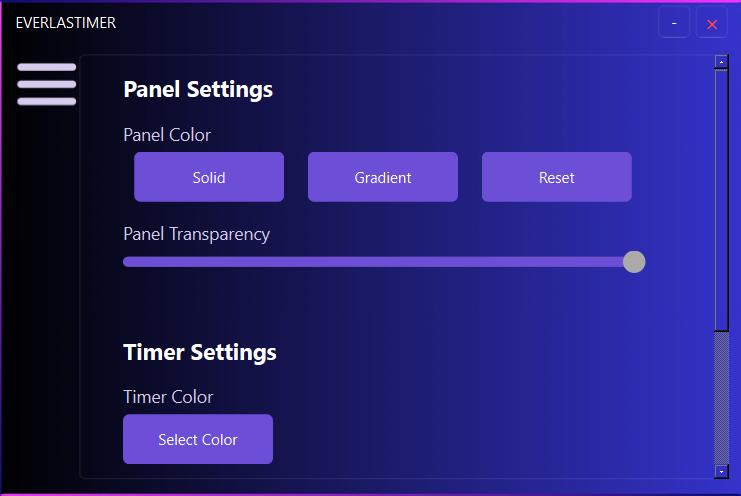

---

````markdown
EVERLASTIMER ⏳  
A Minimal Year-End Progress Tracker by Bitekoi Labs  

---
 
About:

EVERLASTIMER is a clean, minimal floating widget for your desktop that helps you track exactly how much of the year is left — down to months, weeks, days, hours, and even minutes. It's designed to boost self-awareness, inspire self-improvement, and keep your yearly goals visible at all times.

---

Features

✅ Floating, always-on-top year tracker  
✅ Shows time left in months, weeks, days, hours. 
✅ Highly customizable panel colors and transparency  
✅ Gradient or solid background options  
✅ Adjustable timer font and color  
✅ Simple, intuitive settings panel  
✅ Lightweight and distraction-free  
✅ Built with PyQt6  

---

Why?

We often lose track of how fast the year flies by. EVERLASTIMER gives you a constant, visual reminder — helping you stay focused, avoid procrastination, and finish the year strong.

---

Screenshots



(./screenshots/faq_Screenshot.png)

---

How to Run

WIll BE UPDATED SOON!!!


Support Development ☕

If you'd like to support this project, consider donating:
[☕ Support on buymeacoffee](https://buymeacoffee.com/student_success)

---

Roadmap
[ ] Add custom deadline support
[ ] Cross-platform builds
[ ] Community suggestions

---


© 2025 Bitekoi Labs

